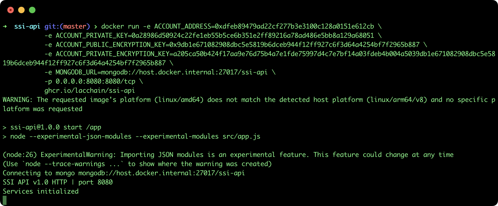

## Deploy SSI API

This tutorial describes the steps to deploy the Self-Sovereign API REST that allows to build a Blockchain-based Root-of-Trust and issue/revoke/verify Verifiable Credentials:
Below you will find a set of tutorials that explore all the possibilities using this API.

1. [Generate a new DID](./1.%20Generate%20DID.md)
2. [Register an X.509 RSA certificate to a DID](./2.%20Register%20X.509%20in%20DID.md)
3. [Deploy a regional Public Key Directory (PKD)](./3.%20Deploy%20PKD.md)
4. [Deploy a national Trusted List (TL)](./4.%20Deploy%20TL.md)
5. [Register a TL in a PKD](./5.%20Register%20a%20TL%20in%20a%20PKD.md)
6. [Register an Entity in a TL](./6.%20Register%20an%20Entity%20in%20a%20TL.md)
7. [Revoke a TL in a PKD](./7.%20Revoke%20a%20TL%20in%20a%20PKD.md)
8. [Revoke an Entity in a TL](./8.%20Revoke%20an%20Entity%20in%20a%20TL.md)
9. [Issue a Verifiable Credential](./9.%20Issue%20Verifiable%20Credential.md)
10. [Verify a Verifiable Credential](./10.%20Verify%20Verifiable%20Credential.md)
11. [Revoke a Verifiable Credential](./11.%20Revoke%20Verifiable%20Credential.md)

### Pre-requisites

- **NodeJS**: =v14.4.0
- **MongoDB**: >v4.0
- **Docker**: >v4.8 (Optional for that deploy method)

### Deploy from source code

#### 1. Clone repository
In order to deploy the API from source code it is necessary to clone the repository executing the following command:

``` bash 
git clone https://github.com/lacchain/ssi-api
```

The output of the command should download the source code in the **ssi-api** folder from the
repository, as shown in the following image:


#### 1. Install NodeJS version 14.4

The API is developed in version 14.4 of Node JS. To install this version it is recommended to use the [NVM version manager](https://github.com/nvm-sh/nvm), executing the following command:

```bash
nvm use 14.4
```


#### 3. Configure API

**Note**: This tutorial assumes that you already have the MongoDB installed and running in the localhost at 27017 port.

Set the environment variables (see Configuration):

``` bash 
export ACCOUNT_ADDRESS=0xdfeb89479ad22cf277b3e3100c128a0151e612cb
export ACCOUNT_PRIVATE_KEY=0a28986d50924c22fe1eb55b5ce6b351e2ff89216a78ad486e5bb8a129a68051
export ACCOUNT_PUBLIC_ENCRYPTION_KEY=0x9db1e671082908dbc5e5819b6dceb944f12ff927c6f3d64a4254bf7f2965b887
export ACCOUNT_PRIVATE_ENCRYPTION_KEY=a205ca50b424f17aa9e76d75b4a7e1fde75997d4c7e7bf14a03fdeb4b004a5039db1e671082908dbc5e5819b6dceb944f12ff927c6f3d64a4254bf7f2965b887
``` 

Now, it is necessary to install the dependencies executing the next command:

``` bash 
yarn install
``` 


After doing that, just run the following command  to start the server:

``` bash 
npm start
``` 

If everything goes correctly, the server will run at http://localhost:8080:


### Deploy from Docker

There is a way to run the API server from Docker image, to do that you need first pull the image from the github registry:

``` bash 
docker pull ghcr.io/lacchain/ssi-api:latest
```


Now you are ready to start the server, just specify the environment variables (see Configuration section) by execute the next command:

``` bash 
docker run -e ACCOUNT_ADDRESS=0xdfeb89479ad22cf277b3e3100c128a0151e612cb \
-e ACCOUNT\_PRIVATE\_KEY=0a28986d50924c22fe1eb55b5ce6b351e2ff89216a78ad486e5bb8a129a68051 \
-e ACCOUNT\_PUBLIC\_ENCRYPTION_KEY=0x9db1e671082908dbc5e5819b6dceb944f12ff927c6f3d64a4254bf7f2965b887 \
-e ACCOUNT\_PRIVATE\_ENCRYPTION_KEY=a205ca50b424f17aa9e76d75b4a7e1fde75997d4c7e7bf14a03fdeb4b004a5039db1e671082908dbc5e5819b6dceb944f12ff927c6f3d64a4254bf7f2965b887 \
-e MONGODB_URL=mongodb://host.docker.internal:27017/ssi-api \
-p 0.0.0.0:8080:8080/tcp \
ghcr.io/lacchain/ssi-api
```
**Note**: This tutorial assumes that you have installed MongoDB in the host at 8080 port.

The previous command will start and expose the SSI API at http://localhost:8080 url.




### Swagger API

The full documentation of API is available in Swagger at http://localhost:8080.


### Configuration variables

| Environment Variable           | Default value                                           | Required              | Description                                                                                                                                                   |
|--------------------------------|---------------------------------------------------------|-----------------------|---------------------------------------------------------------------------------------------------------------------------------------------------------------|
| NETWORK_RPC                    | https://writer.lacchain.net                             | yes                   | Besu node RPC url                                                                                                                                             |
| NODE_ADDRESS                   |                                                         | no                    | Node address (for LACChain Gas Model)                                                                                                                         |
| NODE_EXPIRATION                |                                                         | no                    | Expiration time (for LACChain Gas Model)                                                                                                                      |
| ACCOUNT_ADDRESS                |                                                         | yes                   | Account address that will act as sender of all transactions                                                                                                   |
| ACCOUNT_PRIVATE_KEY            |                                                         | yes                   | Account private key that will sign transactions                                                                                                               |
| ACCOUNT_PUBLIC_ENCRYPTION_KEY  |                                                         | no (yes for issue VC) | NaCl public key used to encrypt VC sent using DIDComm protocol in Mailbox (must be registered as keyAgreement Verification Method in the account address DID) |
| ACCOUNT_PRIVATE_ENCRYPTION_KEY |                                                         | no (yes for issue VC) |                                                                                                                                                               |
| MONGODB_URL                    | mongodb://localhost:27017/ssi-api                       | yes                   |                                                                                                                                                               |
| MAILBOX_DID                    | did:lac:main:0x5c3968542ca976bec977270d3fe980dd4742865e | no                    | Mailbox DID, the default value is for Legacy Mailbox. For OpenProTest Newtwork use: did:lac:openprotest:0xf33bc23691245c2d5de99d7d45e9fdd113495870            |
| NETWORK_NAME                   | main                                                    | no                    | Network name used for DID suffix (i.e. did:lac:<network_name>). Default is main which points to Legacy Network. For OpenProTest Network use: openprotest      |

